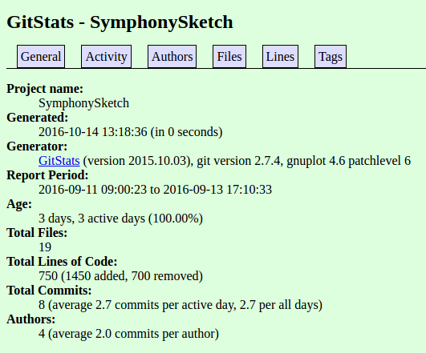

# Lab 6:

## Part 1

## Project 31: **SquareMeals**
### URL: https://github.com/harrij15/SquareMeals
### Contributors:  7
### Lines of Code: 17742
### First Commit:  "Initial Commit" - 12/27/15
### Latest Commit: "Fixed Merge Conflict" - 9/19/16
### Current Branches:
#### * `master`
#### * `branch`
#### * `whataredreams`
#### * `twig`
#### * `squaremeals`
#### * `search_links`
### GitStats:

### Gource:

## Project 32: **Submitty**
### URL: https://github.com/submitty/submitty
### Contributors:  25
### Lines of Code: 147834
### First Commit:  "init commit" - 1/31/14
### Latest Commit: "Added redirect to point http request to https" - 10/12/16
### Current Branches:
#### * `master`
#### * `build_improvements`
#### * `redirect`
#### * `grading_queue`
#### * `fix-rainbow-grades-rsync-push`
### GitStats:

### Gource:

## Project 33: **SymphonySketch**
### Contributors:  2
### Lines of Code: 806
### First Commit:  "Initial commit" - 9/11/16
### Latest Commit: "Changed pen to white, added inactive color chooser button" - 9/13/16
### Current Branches:
#### * `master`
### GitStats:

### Gource:

## Project 34: **The Weird Side of YouTube**
### Contributors:  6
### Lines of Code: 19031
### First Commit:  "first commit" - 9/29/16
### Latest Commit: "Small change to div" - 10/13/16
### Current Branches:
#### * `master`
#### * `newstyle`
#### * `WindowsApp`
### GitStats:

### Gource:

## Project 35: **UFDS**
### Contributors:  1
### Lines of Code: 23
### First Commit:  "Initial commit" - 9/13/16
### Latest Commit: "Added scalastyle, at least initially. Build will fail if style is incorrect." - 10/17/16
### Current Branches:
#### * `master`
### GitStats:

### Gource:

# Part 2:

## 
